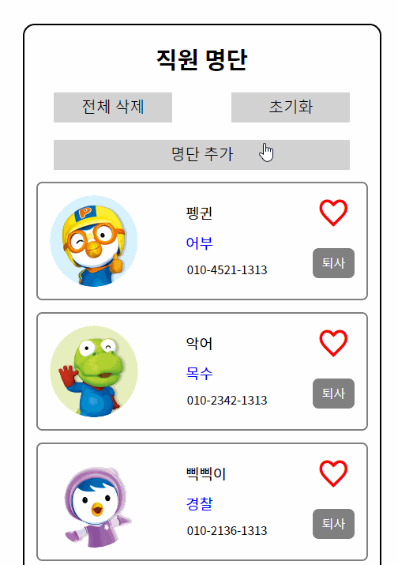
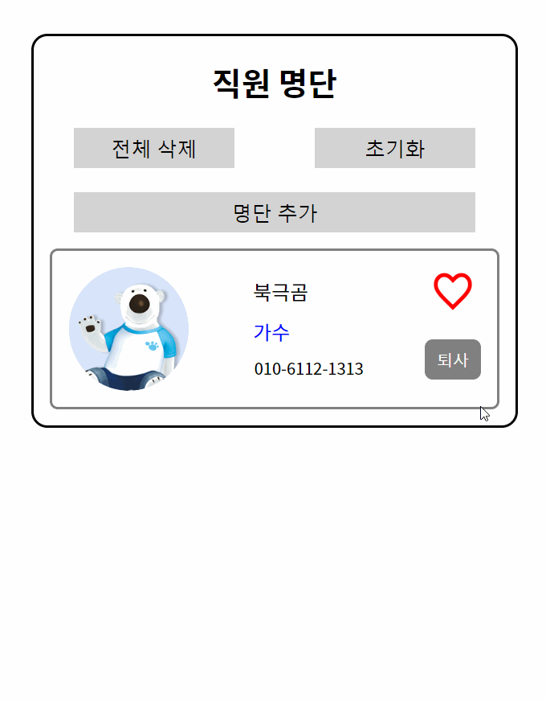

# AM-module-react

[Module 페이지](https://github.com/yeonhub/AM-module)

지난번 vanilla js로 구현했던 과제를 React를 사용해 다시 만들고 새로운 기능을 추가했다.

## React 구조

폴더 구조

```javascript
src ─   staff   ┌   Staff.js
                ├   Staff.scss
                ├   StaffList.js
                ├   StaffForm.js
                └   StaffItem.js
```

컴포넌트 구조

```javascript
Staff.js    ┌   Staff.scss
            ├   StaffForm.js
            └   StaffList.js    ─   StaffItem.js
```

|       | 기능                                            | 하위 컴포넌트 | 기능           | 하위 컴포넌트 | 기능            |
| ----- | ----------------------------------------------- | ------------- | -------------- | ------------- | --------------- |
| Staff | button<br />StaffForm 출력<br />StaffList 출력 | StaffForm     | 명단추가       |               |                 |
|       |                                                 | StaffList     | StaffItem 출력 | StaffItem     | Staff 명단 출력 |

## 추가 기능

#### 1) 퇴사



```javascript
const StaffItem = ({ item, onDel, onLike }) => {
    const { id, img, name, job, tel, like } = item
    return (
        <li>
            
            <div>
                <strong>{name}</strong>
                <span>{job}</span>
                <p>{tel}</p>
            </div>
            <div>
                {
                    like ? <i className='xi-heart' onClick={() => onLike(id)}></i> : <i className='xi-heart-o' onClick={() => onLike(id)}></i>
                }

	// 직원 명단 item li 생성시 퇴사 button 생성
	// onDel 함수 실행과 동시에 id를 넘겨준다.

                <button onClick={() => onDel(id)}>퇴사</button>
            </div>
        </li>
    );
};
```

```javascript
    const onDel = (id) => {

	// id를 받으면 해당 id와 data의 id가 같지 않은 객체들 생성한다 (원본을 바꾸지 않음)

        setData(data.filter(item => item.id !== id))
    }
```

#### 2. 명단 추가



```javascript
const StaffForm = ({ onAdd }) => {

	// 명단 추가시 사용할 변수 생성

    const [user, setUser] = useState(
        { name: '', job: '', tel: '', img: '' }
    )
    const nameRef = useRef(null)
    const { name, job, tel, img } = user
    const changeInput = e => {
        const { name, value } = e.target

	// user객체에 기존의 내용은 남겨주고 name, job, tel, img 키의 값에 추가해 준다.

        setUser({ ...user, [name]: value })
    }
    const onSubmit = e => {
        e.preventDefault();

	// form submit시 이름, 직업, 연락처, 사진중 하나라도 입력된 값이 없으면
	// return으로 onSubmit 함수를 빠져나오고
	// 모두 입력 되었을 때 onAdd 함수를 실행시켜주고 기존 input 값을 지워준다.
	// 마지막으로 이름 input에 focus

        if (!name || !job || !tel || !img) return
        onAdd(user)
        setUser({ name: '', job: '', tel: '', img: '' })
        nameRef.current.focus();
    }
    return (
        <form onSubmit={onSubmit}>
            <p>
                <label htmlFor="">이름</label>
                <input type="text" name='name' value={name} onChange={changeInput} ref={nameRef} placeholder='이름'/>
            </p>
            <p>
                <label htmlFor="">직업</label>
                <input type="text" name='job' value={job} onChange={changeInput} placeholder='직업'/>
            </p>
            <p>
                <label htmlFor="">연락처</label>
                <input type="text" name='tel' value={tel} onChange={changeInput} placeholder='010-0000-0000'/>
            </p>
            <p>
                <label htmlFor="">사진</label>
                <input type="text" name='img' value={img} onChange={changeInput} placeholder='사진 링크'/>
            </p>
            <p>
                <button>추가</button>
            </p>
        </form>
    );
};
```
